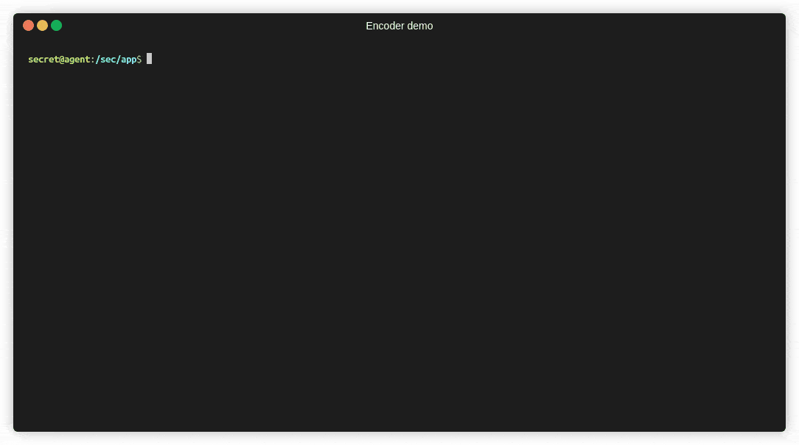

# CS-12 Final Project

Drew Phillips  
Professor STU  
CS-12 (0656)  
Winter 2020  

## Overview

This is my final project for [CS-12][cs12-oor], Assembly Language Programming / Computer Architecture. The course is
focused on x86-64 assembly language ([AMD64][x86-64]) for Linux based operating systems.

For the project I have written code to encode and decode messages with a [one-time pad][one-time-pad] (OTP) using the
[Vernam cipher][vernam]. The project was inspired by messages transmitted by means of [numbers stations][numstations],
which use radio transmissions to broadcast secret messages.

The project produces two executables: one be used by an agency to create secret messages for broadcast, and the other
which can decode received messages. The agency program produces truly random one-time pads and encodes messages with
them, while the agent program decodes messages using the one-time pad given to them by the agency. To help preserve
secrecy in the event of compromise, the agency's pads are destroyed once a message is created, and once an agent
successfully decodes a message, they must overwrite their last pad with a new random pad.

## Requirements

* A 64-bit Linux based OS (e.g. Ubuntu 16.04) 
* OpenSSL
* yasm (The Yasm Modular Assembler)
* GNU project C compiler (gcc)
* GNU make

## Building the software

### Installing dependencies

To install dependencies on an Debian or Ubuntu-based operating system, run:

    sudo apt install gcc make libssl-dev

### Configuring and building

GNU Autotools is used to to produce a build system for the package. To build the software, one simply needs to configure
and make the software. To build the software, simply run

    ./configure && make
    
This produces two binaries, `agency` (for use by the agency) and `agent` (for use by agents in the field).

### Producing a debug build

To configure a build suitable for debugging:

    ASFLAGS="-g dwarf2" \
    CFLAGS="-gdwarf-2 -O0 -DDEBUG" \
    ./configure --prefix=/tmp

## Usage

This section describes how to use the software.

### Using the agency program

The agency program has 2 main purposes: 1) to create one-time pads to distribute to agents and 2) encrypting messages
for transmission using the one-time pads. Pads are stored in text files named after the agent they are assigned to.

To run the agency program, run `./agency` from the location it is installed in.

#### Creating a pad

* Select the menu option *"Create a new pad"*
* Enter the agent ID number (e.g. 007); IDs may only contain digits and cannot exceed 15 characters
* A one-time pad is created and saved to the current directory as *###.txt*, where *###* is the agent ID number 
* Distribute this file to your contact as *agent.txt*

#### Writing a message

* Select the menu option *"Write a message to an agent"*
* Enter the agent's number to select the pad
* When prompted, type the message to encrypt and press Enter
* Your plaintext and one-time pad are output to the screen for visual confirmation
* The ciphertext is displayed on screen in groups of 5 digits
* Once a message is successfully created, the page is burned (overwritten with null bytes)

As long as no backup of the pad is kept, the key used to encrypt is gone and cannot be recovered by the agency. 

### Using the agent program

The agent program is used by field agents to decrypt coded messages they receive. An agent must keep track of and know
their current page in order to decode a message. After successfully decrypting a message, it is imperative that they
burn the page so that previously sent messages cannot be decrypted if their pad is recovered by an adversary. For
security, burned pages are indistinguishable from unused pages. As such, an agent must always remember their next page
number.

The pad for an agent must be stored as `agent.txt` in the same directory as the agent executable.

#### Decrypting a message

* Run the agent program (`./agent`)
* Enter the number of the current page and press Enter
* Input the received message and press Enter when done (spaces are ignored)
* The decrypted messages is output to the console
  * If the wrong page is used or invalid ciphertext is input, the resulting message is gibberish
* When prompted, type `Y` and press Enter to burn the page

## Allowed characters

Messages may only contain a subset of US-ASCII characters which are defined by the pad's substitution table (see
`substitution_table` in `fp_lib.asm`). The table is defined as:

    \x20!"#$%&'()*+,-./0123456789:;=?@ABCDEFGHIJLKMNOPQRSTUVWXYZ\_abcdefghijlkmnopqrstuvwxyz

Only characters in the table are allowed. The table cannot be changed without invalidating existing pads and requiring
new ones to be distributed. If you change the table, keep the old binaries to encrypt and decrypt messages created on
an older table, or distribute new pads.

## Unit tests

Simple unit tests exist in the `tests/test.asm` file. The driver is `test.asm` and it tests various lib functions
provided by the program for encryption, decryption, creating random bytes, and creating pads.

To build & run the tests, use the following command from the project root:

    ./runtests.sh

## TODO

With more time I would like to implement the following features:

* Encrypted pads
  * Encrypt the agent's pad on disk and require a key to unlock it
  * Use PBKDF2 or some other KDF to derive a key from the agent's key

[cs12-oor]: https://portal.santarosa.edu/SRweb/SR_CourseOutlines.aspx?CVID=38123&Semester=20197 "Course outline of record"
[x86-64]: https://en.wikipedia.org/wiki/X86-64 "The x86-64 instruction set"
[one-time-pad]: https://en.wikipedia.org/wiki/One-time_pad "One-time pad"
[vernam]: https://www.cryptomuseum.com/crypto/vernam.htm "The Vernam cipher"
[numstations]: https://www.numbers-stations.com/articles/how-the-one-time-pad-works-cia-instruction/ "How the One Time Pad Works – CIA Instruction"
